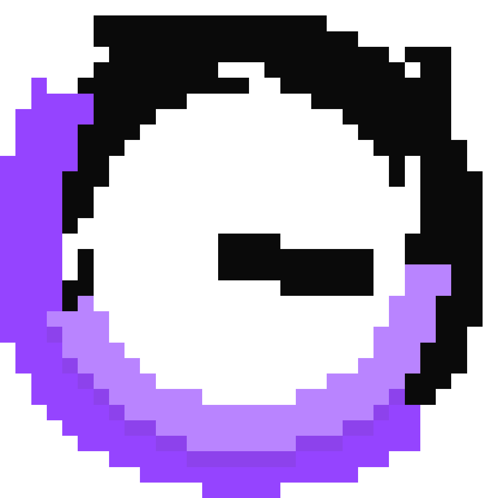

 

<h1 align="center"> GalaTime: Lost Episodes </h1>

    
    

GalaTime: Lost Episodes is a 2D puzzle game inspired by the games from Rusty Lake

## Download

Yet to be released

## Contributing

No forms of Contribution

## License

Yet to add licenses
